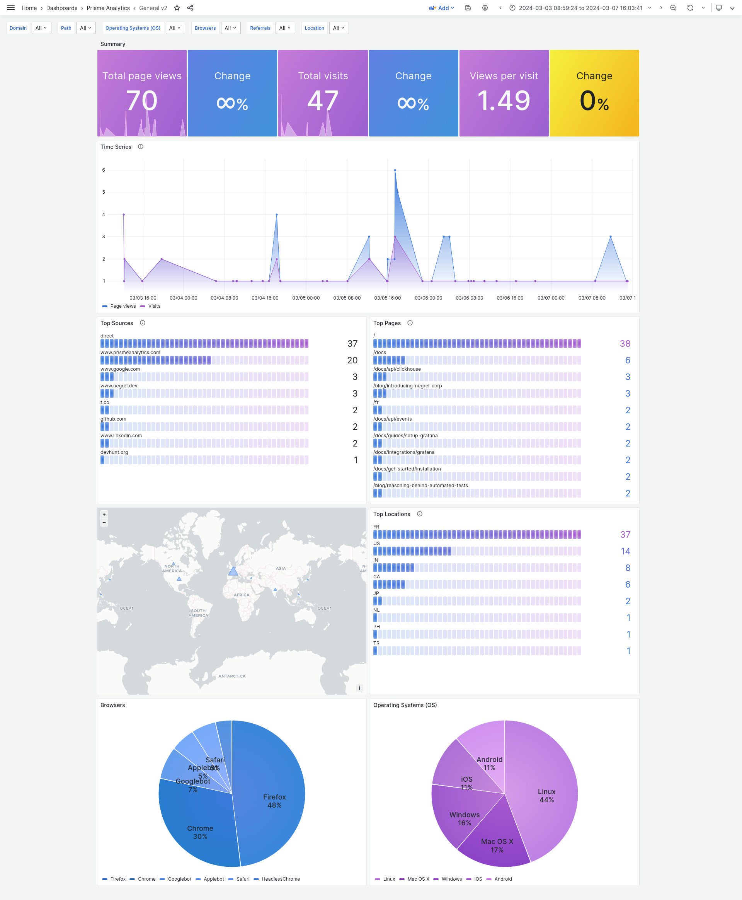

<h1 align="center">
    
</h1>

    
    

# :gem: `prismeanalytics` - An Open Source, privacy-focused and progressive analytics service.

## Configuration

Prisme Analytics server comes with different mode:
* `default`: a full-featured server
* `ingestion`: an event ingestion only server

Both server use environment variables for configuration.

### `default` options

| Variable name | Default value | Description |
|:------------- | :------------ | :---------- |
| `PRISME_ACCESS_LOG`| `/dev/stdout` | Path to access log file. |
| `PRISME_DEBUG`| `false`       | Sets log level to debug. |
| `PRISME_PORT`| `80`           | Web server listening port. |
| `PRISME_TRUST_PROXY`| `false` | Whether `X-Forwarded-For`, `X-Request-Id` and other proxy related headers should be trusted. |
| `PRISME_POSTGRES_URL`| **required** | Postgres connection string. |
| `PRISME_CLICKHOUSE_TLS`| `false` | Use a TLS connection for clickhouse. |
| `PRISME_CLICKHOUSE_HOSTPORT`| **required** | A valid `<host>:<port>` string pointing to a clickhouse instance. |
| `PRISME_CLICKHOUSE_DB`| `prisme` | Clickhouse database to use. |
| `PRISME_CLICKHOUSE_USER`| **required** | Clickhouse user to use. |
| `PRISME_CLICKHOUSE_PASSWORD`| **required** | Clickhouse password to use. |
| `PRISME_SOURCE_REGISTRY_SOURCES`| **required** | Comma separated list (without space) of valid sources. |
| `PRISME_EVENTSTORE_MAX_BATCH_SIZE`| `4096` | Maximum size of batch send to event store. |
| `PRISME_EVENTSTORE_MAX_BATCH_TIMEOUT`| `1m` | Maximum duration before a batch is sent to event store. |

### `ingestion` options

| Variable name | Default value | Description |
|:------------- | :------------ | :---------- |
| `PRISME_ACCESS_LOG`| `/dev/stdout` | Path to access log file. |
| `PRISME_DEBUG`| `false`       | Sets log level to debug. |
| `PRISME_PORT`| `80`           | Web server listening port. |
| `PRISME_TRUST_PROXY`| `false` | Whether `X-Forwarded-For`, `X-Request-Id` and other proxy related headers should be trusted. |
| `PRISME_CLICKHOUSE_TLS`| `false` | Use a TLS connection for clickhouse. |
| `PRISME_CLICKHOUSE_HOSTPORT`| **required** | A valid `<host>:<port>` string pointing to a clickhouse instance. |
| `PRISME_CLICKHOUSE_DB`| `prisme` | Clickhouse database to use. |
| `PRISME_CLICKHOUSE_USER`| **required** | Clickhouse user to use. |
| `PRISME_CLICKHOUSE_PASSWORD`| **required** | Clickhouse password to use. |
| `PRISME_SOURCE_REGISTRY_SOURCES`| **required** | Comma separated list (without space) of valid sources. |
| `PRISME_EVENTSTORE_MAX_BATCH_SIZE`| `4096` | Maximum size of batch send to event store. |
| `PRISME_EVENTSTORE_MAX_BATCH_TIMEOUT`| `1m` | Maximum duration before a batch is sent to event store. |

## Contributing

If you want to contribute to `prismeanalytics` to add a feature or improve the
code, open an [issue](https://github.com/prismelabs/analytics/issues)
or make a [pull request](https://github.com/prismelabs/analytics/pulls).

## :stars: Show your support

Please give a :star: if this project helped you!

## :scroll: License

AGPL-3.0 © [Prisme Analytics](https://www.prismeanalytics.com/)
