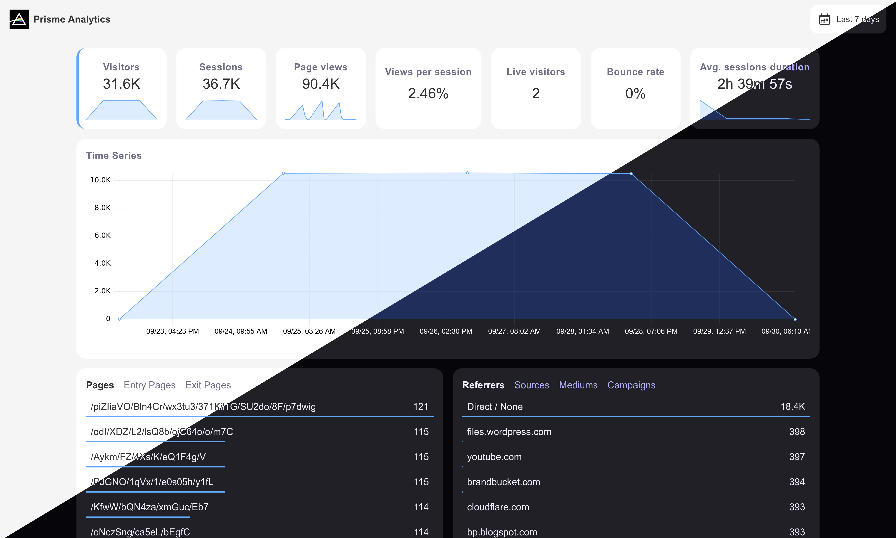

<h1 align="center">
    
</h1>

<p align="center">
    <a href="https://github.com/prismelabs/analytics/raw/master/LICENSE">
        
    </a>
    <a href="https://github.com/prismelabs/analytics/blob/master/CONTRIBUTING.md">
        
    </a>
    <a href="https://hub.docker.com/r/prismelabs/analytics">
        
    </a>
    <a href="https://goreportcard.com/report/github.com/prismelabs/analytics">
        
    </a>
    
    <a href="https://x.com/prismeanalytics">
        
    </a>
</p>

# :gem: Prisme Analytics

[An Open Source, privacy-focused and progressive analytics service.](https://www.prismeanalytics.com/docs/next/)

[Documentation](https://www.prismeanalytics.com/docs)
|
[Live demo](https://app.prismeanalytics.com/grafana)



## Why Prisme ?

Here's what makes Prisme a great alternative to other analytics:
* **Tailored analytics**: Prisme Analytics supports **custom dashboards and events**
so you can collect, visualize analyze metrics that matters to you the way you want.
* **Ready to use**: Prisme also comes with built-ins metrics and dashboards
(see [demo](https://app.prismeanalytics.com/grafana)).
* **Privacy-focused**: Prisme is **GDPRC, CCPA, PECR compliant by design**, no
Personally Identifiable Information (PII) is collected. Tracking script doesn't
use cookies, you can ditch your cookie pop-up.
* **Lightweight**: Prisme tracking script is around 1kB (~45x smaller than
Google Analytics). Noscript tracking handlers (for visitors with javascript
disabled) returns a 35 bytes transparent GIF image.
* **Resource efficient**: Prisme is designed to be fast and resource efficient,
checkout our [benchmarks](#performance).
* **SPA support**: Prisme is built with modern web frameworks in mind and it works
automatically with any pushState based router on the frontend.
* **[Grafana](https://github.com/grafana/grafana) based**: Prisme integrates with
[Grafana](https://github.com/grafana/grafana) that provides:
  * User managements
  * Team managements
  * Permissions managements
  * Multi organizations support
  * Custom dashboards

## Configuration

You can find configuration documentation on
[our website](https://www.prismeanalytics.com/docs/next/reference/server/server-modes/).

## Performance

Prisme Analytics ingestion server is **easily** capable of ingesting more than
50,000 req/s on my AMD Ryzen 7 7840U w/ Radeon 780M Graphics.

```
$ cat /proc/cpuinfo | head | grep 'model name'
model name	: AMD Ryzen 7 7840U w/ Radeon  780M Graphics

$ cd tests/k6/events
$ make start test clean

          /\      |‾‾| /‾‾/   /‾‾/
     /\  /  \     |  |/  /   /  /
    /  \/    \    |     (   /   ‾‾\
   /          \   |  |\  \ |  (‾)  |
  / __________ \  |__| \__\ \_____/ .io

     execution: local
        script: /data/main.js
        output: -
 
     scenarios: (100.00%) 1 scenario, 4096 max VUs, 10m30s max duration (incl. graceful stop):
              * sharedIterationsPageViewEvents: 131072 iterations shared among 4096 VUs (maxDuration: 10m0s, gracefulStop: 30s)

     data_received..................: 90 MB  9.9 MB/s
     data_sent......................: 130 MB 14 MB/s
     http_req_blocked...............: avg=928.82µs min=330ns    med=1.07µs   max=268.74ms p(90)=2.45µs   p(95)=3.16µs  
     http_req_connecting............: avg=911.42µs min=0s       med=0s       max=268.71ms p(90)=0s       p(95)=0s      
     http_req_duration..............: avg=73.92ms  min=57.4µs   med=67.47ms  max=808.82ms p(90)=139.72ms p(95)=167.03ms
       { expected_response:true }...: avg=74.08ms  min=60.26µs  med=67.63ms  max=808.82ms p(90)=139.92ms p(95)=167.43ms
     http_req_failed................: 13.80% ✓ 62640        ✗ 391185
     http_req_receiving.............: avg=3.71ms   min=3.4µs    med=12.13µs  max=221.36ms p(90)=729.89µs p(95)=19.92ms 
     http_req_sending...............: avg=282.26µs min=2.37µs   med=7.27µs   max=216.54ms p(90)=19.27µs  p(95)=105.73µs
     http_req_tls_handshaking.......: avg=0s       min=0s       med=0s       max=0s       p(90)=0s       p(95)=0s      
     http_req_waiting...............: avg=69.92ms  min=45.89µs  med=67.16ms  max=750.36ms p(90)=125.53ms p(95)=140.88ms
     http_reqs......................: 453825 50018.387644/s
     ✓ { event_type:custom }........: 117531 12953.696068/s
     ✓ { event_type:pageview }......: 336294 37064.691576/s
     iteration_duration.............: avg=274.18ms min=121.44µs med=152.26ms max=3.12s    p(90)=680.26ms p(95)=958.77ms
     iterations.....................: 131072 14446.119331/s
     vus............................: 2100   min=2100       max=4096
     vus_max........................: 4096   min=4096       max=4096

running (00m09.1s), 0000/4096 VUs, 131072 complete and 0 interrupted iterations
sharedIterationsPageViewEvents ✓ [ 100% ] 4096 VUs  00m09.1s/10m0s  131072/131072 shared iters
```

## Contributing

If you want to contribute to `prismeanalytics` to add a feature or improve the
code, open an [issue](https://github.com/prismelabs/analytics/issues)
or make a [pull request](https://github.com/prismelabs/analytics/pulls).

## :stars: Show your support

Please give a :star: if this project helped you!

## :scroll: License

[Prisme Analytics](https://www.prismeanalytics.com/) is distributed under
[AGPL-3.0-only](LICENSE). For MIT exceptions, see [LICENSING.md](LICENSING.md)
